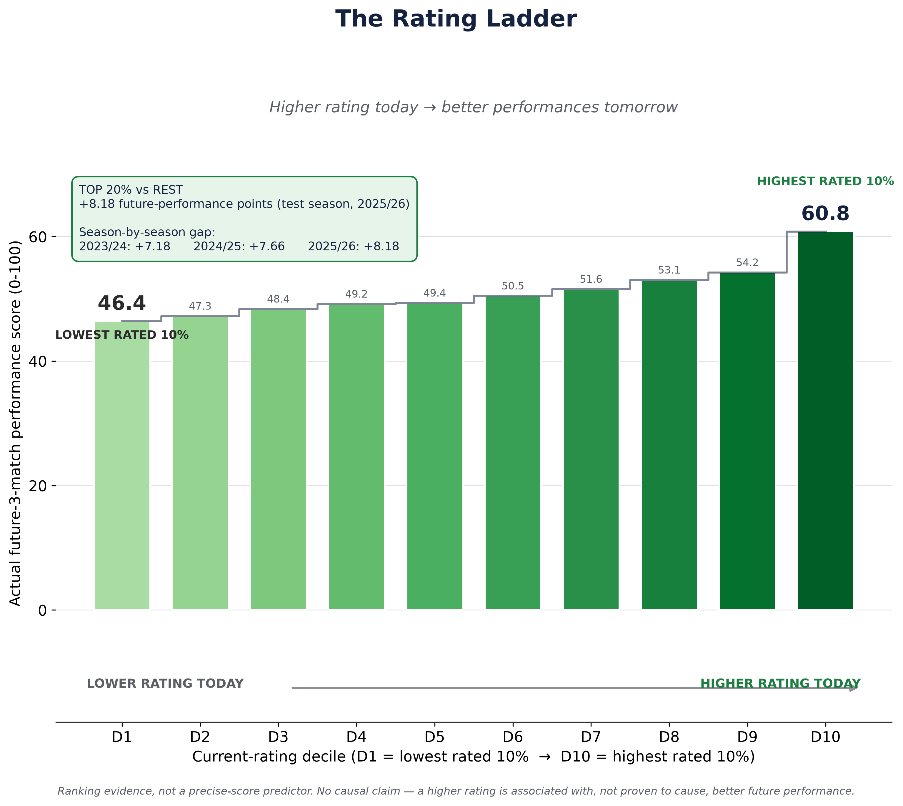
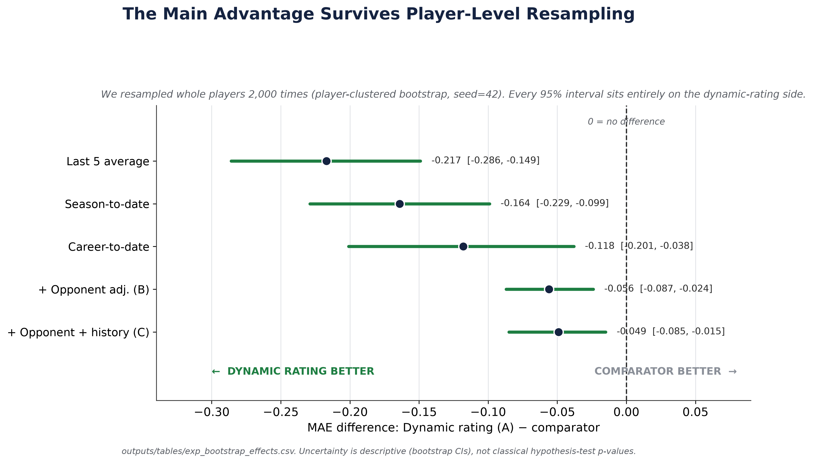

# Beyond Recent Form: Dynamic Player Ratings for Predicting Near-Future Football Performance

> **Publication status: blocked pending data-licence confirmation.** The code and aggregate results
> are prepared locally, but the row-level SoccerSolver data cannot be released without written
> authorization. See `PUBLIC_RELEASE_AUDIT.md`.

## Research question

Can a continuously updated player rating tell us more about how a footballer will perform in his
next few matches than his last few games or his season average?

## Dataset

The final analysis covers the English Championship over 2023/24–2025/26: 1,554 matches, 1,647
players, 62,001 canonical appearances, and 47,315 scoreable player-match observations. The
row-level data came from an internal SoccerSolver export. It is not included because no
redistribution licence was found.

## Performance score and rating

Each eligible appearance receives a position-aware score from 0 to 100. It combines 29 selected
match features across possession, defending, attacking, creation, and goalkeeping. Features are
normalized chronologically and combined within football categories so positions are not rewarded
simply for having more available metrics.

The rating starts on a 1500-centered scale and is updated after every match. Variant A uses a fixed
update rate, with no opponent-strength adjustment and no history-aware decay. Only information
available through the current match is used.

## Prediction task and comparisons

At match T, the method predicts the player's **average performance score over his next three
matches** (T+1 to T+3). It is compared on the same evaluation rows against the last match, last 3,
last 5, season-to-date, career-to-date, and a position prior. Mean absolute error (MAE) is the main
metric; lower MAE means the prediction was closer to subsequent performance.

## Main findings

Variant A achieved MAE **4.231**, compared with **4.448** for last 5 (4.88% lower), **4.395** for
season-to-date, and **4.349** for career-to-date. The player-clustered bootstrap difference versus
last 5 was **-0.217**, with a 95% descriptive interval **[-0.286, -0.149]**. The advantage held at
all tested horizons from 1 to 7 matches. Top-20%-versus-rest future-performance gaps were +7.18,
+7.66, and +8.18 across the three seasons. The advantage was small or absent below roughly 15
tracked matches. Opponent adjustment worsened validation MAE across every tested strength.





## Reproduction

Python 3.12 was used for release testing.

```bash
python -m venv .venv
source .venv/bin/activate
python -m pip install -r requirements.txt
python scripts/verify_release.py
```

The last command verifies the published headline MAEs against the included frozen aggregate table.
Full recomputation requires an authorized copy of the source data. Set `SOCCER_DATA_SQL` to the
authorized PostgreSQL dump and run `bash scripts/reproduce.sh`. The workflow builds raw caches,
the canonical player-match table, performance scores, ratings, future targets, baselines,
calibration, evaluations, robustness tables, and figures. Generated row-level data are ignored by
Git. See `data/README.md` and `docs/methodology.md`.

Expected headline output is Variant A MAE 4.231 on 11,353 test observations. Do not interpret a
failed match as permission to change scientific constants or expected results.

## Limitations

The source data are not publicly redistributable on current evidence, so independent end-to-end
reproduction is blocked. Results concern one competition over three seasons. Goalkeeper prediction
failed under the current scoring target (Variant A test R2 -0.122); this is a limitation of the
target design and sample, not proof that goalkeeper ratings are impossible. Bootstrap intervals are
descriptive rather than formal hypothesis tests.

---

## Researcher

<p align="left">
  
</p>

### Rupayan Halder

**PhD Student**  
Jadavpur University, Kolkata

**Football AI Researcher**

**Assistant Professor**  
University of Engineering & Management (UEM), Kolkata

**Research Collaborator**  
SoccerSolver

**Former Software Engineer — Platform Engineering**  
Session AI

Rupayan's research interests focus on applying artificial intelligence, machine learning, data
analytics, and computational methods to real-world problems in football, including player
performance analysis, recruitment, transfer-market decision-making, and sporting strategy.

### Connect

[GitHub](https://github.com/RupayanHalder39) ·
[LinkedIn](https://www.linkedin.com/in/rupayan-halder-962922209/) ·
[Email](mailto:rupayanhalder313239@gmail.com)

---

## Research Collaboration

<p align="left">
  
</p>

**This research was developed in collaboration with SoccerSolver.**

---

## Citation

Rupayan Halder is a confirmed researcher/author of this project. The complete author list is still
being finalized; no claim of sole authorship is made. Use the metadata in `CITATION.cff`, and resolve
the remaining authorship placeholder before publication.

## Licence

The repository software is provided under the MIT License. This does not grant rights to the
underlying SoccerSolver or third-party data, names, marks, or other provider content. Data access
and redistribution remain subject to separate authorization; see `PUBLIC_RELEASE_AUDIT.md`.
